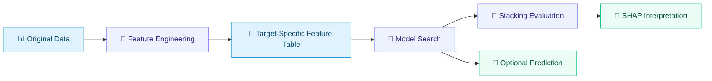

# 🔬 Functional-Group-Atlas-for-Interface-Programming
---
[](https://www.python.org/)
[](https://opensource.org/licenses/MIT)
[](#workflow-at-a-glance)
[](#maintenance-status)

> 🧭 A configuration-first workflow for functional-group feature engineering, interpretable tree-based modelling, and target-aware analysis of `Eb` and `NVOA`.

---

## ✨ Project Snapshot

| | |
|---|---|
| **🎯 Purpose** | Organize the computational workflow behind a functional-group atlas for interface programming |
| **🧩 Structure** | Two sequential Jupyter notebooks with clearly separated user-configuration areas |
| **🔁 Data flow** | Stable, target-aware filenames connect feature engineering, modelling, interpretation, and prediction |

This repository is intentionally compact, but not opaque: readers can understand the role of each stage, identify where user settings belong, and follow the intended execution order without relying on pre-generated results.

---

## 📂 Repository Contents

| File | Role |
|---|---|
| [`Original_data.xlsx`](./Original_data.xlsx) | Original descriptor database containing the `Eb` and `NVOA` targets |
| [`Feature engineering-FGA.ipynb`](./Feature%20engineering-FGA.ipynb) | Feature filtering, model-informed screening, iterative refinement, and handoff-table generation |
| [`Tree_stacking-FGA.ipynb`](./Tree_stacking-FGA.ipynb) | Hyperparameter search, stacking, model interpretation, and optional prediction |
| [`requirements.txt`](./requirements.txt) | Minimal Python runtime dependencies |
| [`LICENSE`](./LICENSE) | MIT License for the released code |

---

<a id="workflow-at-a-glance"></a>

## 🧭 Workflow at a Glance



> [!IMPORTANT]
> Select either `Eb` or `NVOA` in the configuration area and complete the workflow once for each required target.

### 1️⃣ Feature Engineering

Open [`Feature engineering-FGA.ipynb`](./Feature%20engineering-FGA.ipynb) and set:

```python
TARGET_COLUMN = 'Eb'  # or 'NVOA'
```

The notebook performs three high-level tasks:

1. 🧹 control descriptor redundancy;
2. 🧠 prioritize informative features using model interpretation;
3. 🔁 refine the feature set and export a workflow-ready table.

Its primary handoff file is:

```text
selected_features_<target>.xlsx
```

### 2️⃣ Model Search, Stacking & Interpretation

Open [`Tree_stacking-FGA.ipynb`](./Tree_stacking-FGA.ipynb), select the same `TARGET_COLUMN`, and run its code cells from top to bottom in the same notebook session.

| Part | Responsibility |
|---|---|
| **B-1 · 🔧 Search** | Prepare the selected feature table and optimize the enabled base learners |
| **B-2 · 🧱 Evaluate** | Build the stacking workflow, evaluate its behaviour, and generate interpretation outputs |
| **B-3 · 🔮 Predict** | Optionally retrain the workflow and predict a user-provided external table |

The main analysis workbook is:

```text
shap_analysis_results_<target>.xlsx
```

### 3️⃣ Optional Prediction

Prepare an Excel file whose first column is an identifier and whose remaining columns follow the selected-feature order used for training. Set `UNKNOWN_DATA_FILE` in the prediction configuration area.

Results are exported as:

```text
prediction_results_<target>.xlsx
```

<details>
<summary><strong>📁 Generated artifact naming</strong></summary>

The notebooks use a consistent lowercase suffix—`eb` or `nvoa`—for generated files. This prevents one target from overwriting the results of the other and makes each stage's upstream/downstream relationship explicit.

</details>

---

## 🚀 Quick Start

### ① Install

Use an existing Jupyter-compatible Python environment:

```bash
pip install -r requirements.txt
```

### ② Configure

Each code cell begins with a clearly marked configuration area. Adjust target selection, file paths, search spaces, cross-validation settings, enabled models, and export options only in that section.

### ③ Run in Order

```text
Feature engineering-FGA.ipynb
        ↓
Tree_stacking-FGA.ipynb · B-1
        ↓
Tree_stacking-FGA.ipynb · B-2
        ↓
Tree_stacking-FGA.ipynb · B-3
```

> [!TIP]
> Keep the notebooks and generated files in the same working directory during a complete run so downstream stages can locate their inputs automatically.

---

## 📜 License and Correspondence

The code in this repository is released under the [**MIT License**](https://opensource.org/licenses/MIT); see [`LICENSE`](./LICENSE) for details.

For research correspondence, please contact:  
Prof. [Guangmin Zhou](mailto:guangminzhou@sz.tsinghua.edu.cn) 📧

---

## 🙏 Acknowledgements

[Yifei Zhu](mailto:zhuyifeiedu@126.com) at Tsinghua University conceived and formulated the algorithms, built the quantum-chemistry database, developed and deposited the code, and authored the workflow documentation.

---

<a id="maintenance-status"></a>
